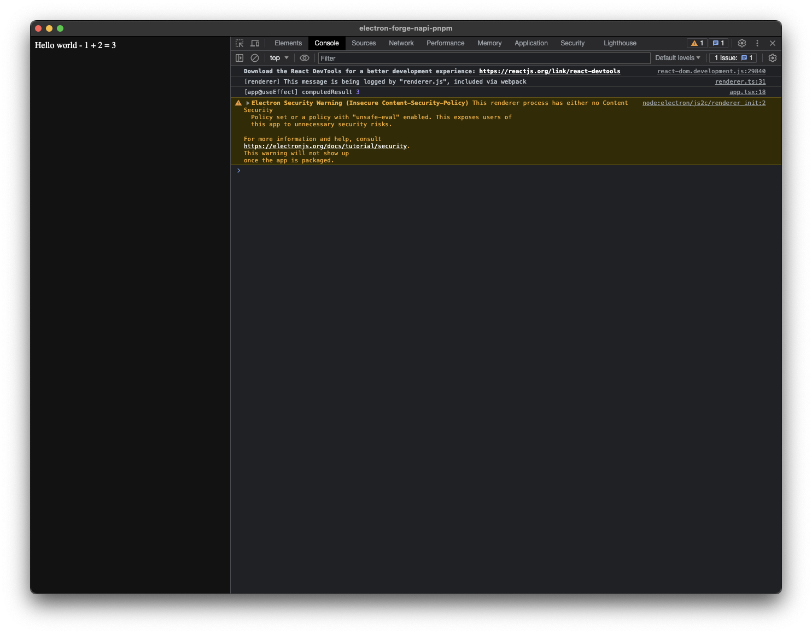
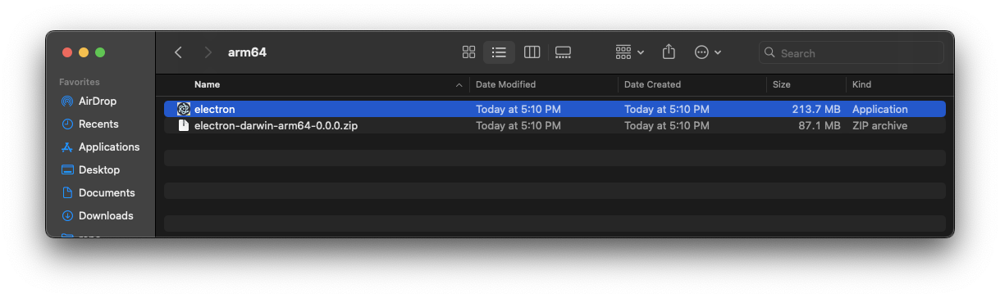
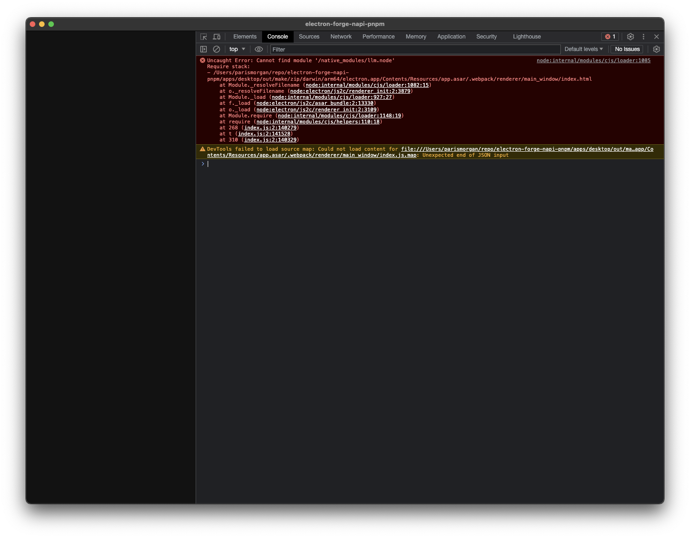

# electron-forge-napi-pnpm

This repo builds a simple Electron app using:
- `electron-forge`: https://www.electronforge.io/
- `node-addon-api`: https://github.com/nodejs/node-addon-api

It is used to repro a bug where when running `electron-forge make` the `node-addon-api` package cannot be found.

## Running
Setup:
- `brew install nvm`
- `nvm install v18.16.0`
- `nvm use v18.16.0`

Running locally:
- `cd ~/repo/electron-forge-napi-pnpm/desktop && npm i`
- `cd ~/repo/electron-forge-napi-pnpm/desktop && npm run dev`

The app should pop up and work:



Packaging app:
- `cd ~/repo/electron-forge-napi-pnpm/desktop && npm i`
- `cd ~/repo/electron-forge-napi-pnpm/desktop && npm run make`

You should get a log like `Artifacts available at: /Users/parismorgan/repo/electron-forge-napi-pnpm/desktop/out/make`:
- Navigate to `/Users/parismorgan/repo/electron-forge-napi-pnpm/desktop/out/make/zip/darwin/arm64/`
- Double click on `electron-darwin-arm64-0.0.0.zip` to extract the app.
- Double click on the `electron` file to run the app.



You'll then see it doesn't work:



```
Uncaught Error: Cannot find module '/native_modules/llm.node'
Require stack:
- /Users/parismorgan/repo/electron-forge-napi-pnpm/desktop/out/make/zip/darwin/arm64/electron.app/Contents/Resources/app.asar/.webpack/renderer/main_window/index.html
    at Module._resolveFilename (node:internal/modules/cjs/loader:1082:15)
    at o._resolveFilename (node:electron/js2c/renderer_init:2:3879)
    at Module._load (node:internal/modules/cjs/loader:927:27)
    at f._load (node:electron/js2c/asar_bundle:2:13330)
    at o._load (node:electron/js2c/renderer_init:2:3109)
    at Module.require (node:internal/modules/cjs/loader:1148:19)
    at require (node:internal/modules/cjs/helpers:110:18)
    at 602 (index.js:2:38)
    at t (index.js:2:141499)
    at 88 (index.js:2:141076)
```